# Introdução

Informações básicas do projeto.

* **Projeto:** Zella
* **Repositório GitHub:** https://github.com/ICEI-PUC-Minas-PMGES-TI/pmg-es-2026-1-ti1-0438100-nexo-2
* **Membros da equipe:**

  * [Bernardo Guedes da Silveira](https://github.com/Bernardo-Guedes) 
  * [Gabriel Moreira Bonifácio de Azevedo](https://github.com/TibaJr) 
  * [Giovanna Marques Freire Barbosa](https://github.com/giomfb07)
  * [Gustavo Ryan Gomes Guedes](https://github.com/gustavoryan-del)
  * [Rafael Felipe Oliveira do Espirito Santo](https://github.com/rizencoding)
  * [Sophia de Fatima Simões Almeida](https://github.com/sophiafatima)
  * [Warlley Silva Baião Braga](https://github.com/warlleyz)
 
A documentação do projeto é estruturada da seguinte forma:

1. Introdução
2. Contexto
3. Product Discovery
4. Product Design
5. Metodologia
6. Solução
7. Referências Bibliográficas

✅ [Documentação de Design Thinking (MIRO)](https://miro.com/app/board/uXjVGttxm6w=/?share_link_id=405329199487)

# Contexto

O projeto Zella surge em um contexto urbano onde problemas de infraestrutura impactam diretamente a qualidade de vida da população. Buracos em vias públicas, iluminação precária, patrimônios deteriorados, falta de manutenção em espaços públicos e outras ocorrências urbanas são problemas frequentes enfrentados diariamente pelos cidadãos.

Nesse cenário, percebe-se a dificuldade da população em registrar denúncias e acompanhar o andamento das solicitações realizadas junto aos órgãos responsáveis. Além disso, os métodos tradicionais de atendimento, como ligações telefônicas e atendimentos presenciais, muitas vezes apresentam processos burocráticos, lentos e pouco transparentes.

Diante dessa realidade, o Zella propõe uma solução tecnológica voltada para modernizar a comunicação entre cidadãos, órgãos públicos e empresas responsáveis pela infraestrutura urbana, utilizando um sistema web centralizado para registro, acompanhamento e gerenciamento de denúncias.

## Problema

Atualmente, muitos cidadãos enfrentam dificuldades para comunicar problemas urbanos às autoridades responsáveis e acompanhar o processo de resolução dessas demandas. A ausência de um sistema centralizado e transparente dificulta tanto o registro das denúncias quanto o acompanhamento das ações realizadas pelos responsáveis.

Além disso, os processos convencionais utilizados por prefeituras e empresas de infraestrutura costumam ser burocráticos e pouco eficientes, comprometendo a organização das informações, a comunicação entre as partes envolvidas e a tomada de decisões estratégicas.

Nesse contexto, a falta de integração entre população, órgãos públicos e empresas responsáveis pela execução de serviços urbanos contribui para atrasos, falta de transparência e insatisfação da população em relação à gestão urbana.

## Objetivos

Objetivo Geral

Desenvolver um sistema web que funcione como um canal eficiente de denúncia, comunicação e transparência entre a população, órgãos públicos e empresas de infraestrutura, contribuindo para a melhoria da gestão urbana e da qualidade de vida da população.

Objetivos Específicos
- Permitir que cidadãos registrem denúncias de problemas urbanos de forma simples e acessível;
- Possibilitar o acompanhamento em tempo real do andamento das solicitações;
- Facilitar a comunicação entre população, órgãos públicos e empresas responsáveis;
- Disponibilizar informações que auxiliem gestores na análise e tomada de decisão;
- Promover maior transparência nos processos de atendimento e resolução das demandas;
- Centralizar o gerenciamento das denúncias em uma única plataforma digital.

## Justificativa

O desenvolvimento do sistema Zella se justifica pela necessidade de melhorar a comunicação entre a população, os órgãos públicos e as empresas responsáveis pela infraestrutura urbana.

Atualmente, muitos cidadãos enfrentam dificuldades para registrar denúncias e acompanhar a resolução de problemas urbanos, o que gera insatisfação, sensação de abandono e falta de confiança nos responsáveis pela manutenção da cidade.

Além disso, métodos tradicionais de atendimento, como ligações telefônicas e atendimentos presenciais, tendem a ser burocráticos, lentos e pouco transparentes. A ausência de um sistema centralizado também dificulta a organização das informações e compromete a eficiência na resolução das demandas urbanas.

Dessa forma, o Zella propõe uma solução tecnológica que simplifica o registro de denúncias, permite o acompanhamento em tempo real e promove maior transparência em todas as etapas do processo.

O projeto se destaca não apenas pela proposta tecnológica, mas também pelo impacto social, ao contribuir para a modernização da gestão urbana, otimização dos serviços públicos e melhoria da qualidade de vida da população.

## Público-Alvo

O sistema Zella é direcionado a três principais grupos de usuários: população em geral, órgãos públicos e empresas de infraestrutura.

População em Geral

A população representa os cidadãos que desejam registrar denúncias e acompanhar a resolução de problemas urbanos. Esse público é composto por pessoas de diferentes faixas etárias, níveis de escolaridade e graus de familiaridade com tecnologia.

Por esse motivo, o sistema deve possuir uma interface simples, intuitiva e acessível, permitindo que qualquer usuário consiga utilizar as funcionalidades sem dificuldades técnicas.

Dentro do sistema, esses usuários atuam como solicitantes e acompanhantes das demandas registradas.

Órgãos Públicos

Os órgãos públicos, especialmente prefeituras e setores responsáveis pela manutenção urbana, utilizam o sistema para acompanhar, gerenciar e atuar nas demandas registradas pela população.

Esses usuários possuem maior nível de conhecimento técnico e administrativo, e por isso possuem prioridade na atuação de determinadas obras e demandas específicas relacionadas à gestão pública urbana.

Empresas de Infraestrutura

As empresas de infraestrutura também atuam diretamente nas demandas registradas no sistema, sendo responsáveis pela execução de serviços como obras, reparos e manutenções urbanas.

Esses usuários utilizam o sistema como ferramenta de trabalho e comunicação, podendo atualizar o andamento das atividades e informar a conclusão dos serviços realizados.

# Product Discovery

## Etapa de Entendimento

Durante a etapa de entendimento, foi aplicada a abordagem de Design Thinking, com o objetivo de compreender profundamente o problema relacionado à comunicação entre a população, empresas de infraestrutura e órgãos públicos. 

*Matriz CSD*

 CERTEZAS: 
  * A tecnologia pode facilitar a comunicação entre cidadãos e órgãos públicos.
  * Falta de manutenção urbana pode causar acidentes e transtornos.
  * Relatos organizados podem ajudar no planejamento urbano.
  * Um sistema simples e fácil de usar aumentaria o número de usuários.
  * Informações com localização e imagens facilitam a resolução do problema.
  * A organização dos dados permite encontrar regiões com maior necessidade de manutenção.
  * A divulgação do sistema é essencial para que mais pessoas da comunidade possam divulgar suas dores e para garantir a visibilidade da prefeitura.
    
SUPOSIÇÕES:
 * Centralizar os relatos ajudaria a prefeitura a identificar problemas mais rapidamente.
 * Um sistema com fotos aumentaria a confiabilidade dos relatos.
 * O acompanhamento do status do problema incentivaria mais pessoas a participar.
 * Se os problemas fossem resolvidos rapidamente, mais pessoas passariam a usar a plataforma.
 * Notificações sobre atualização do problema aumentariam o engajamento.
 * A categorização dos problemas ajudaria na organização dos relatos.
   
DÚVIDAS:
 * Como garantir que os relatos enviados são verdadeiros?
 * Como evitar relatos duplicados do mesmo problema?
 * Como manter os usuários informados sobre a resolução do problema?
 * Como incentivar a população a usar a plataforma?
 * Como proteger os dados dos usuários?
 * Como integrar a plataforma com sistemas já utilizados por órgãos responsáveis?
 * Como garantir visibilidade as dores dos nossos usuários?


## Etapa de Definição

### Personas


# Product Design

Nesse momento, vamos transformar os insights e validações obtidos em soluções tangíveis e utilizáveis. Essa fase envolve a definição de uma proposta de valor, detalhando a prioridade de cada ideia e a consequente criação de wireframes, mockups e protótipos de alta fidelidade, que detalham a interface e a experiência do usuário.

## Histórias de Usuários

Com base na análise das personas foram identificadas as seguintes histórias de usuários:

| EU COMO... | QUERO/PRECISO ...       | PARA ...              |
| --------------------- | ------------------------------------------ | -------------------------------------- |
| Cidadão               | Uma plataforma onde posso registrar uma denúncia com fotos, localização e descrição do problema | Que as autoridades ou empresas responsáveis possam identificar e resolver a situação com mais rapidez          |
| Cidadão         | Gostaria de acompanhar o status das minhas denúncias em tempo real      | Saber se o problema já está sendo resolvido ou concluído, evitando incertezas e falta de informação |
| Cidadão         | Receber notificações sobre problemas no meu bairro e atualizações das denúncias      | Me manter informado e poder tomar decisões mais seguras no meu dia a dia |
| Empresa de Infraestutura         | Uma plataforma única para gerir ordens de serviço, comprovações de campo e prazos contratuais.      | Monitorar o cumprimento rigoroso dos prazos contratuais em tempo realcontas |
| Funcionário de campo da empresa         | Uma interface móvel simples para atualizar o status do progresso (0% a 100%) e anexar a foto da obra finalizada      | Dar baixa imediata na ordem de serviço sem precisar preencher relatórios manuais ao final do dia|
| Gerente de operações da empresa         | Um painel de controle de metas e alocação de recursos em tempo real.      | Reduzir custos com retrabalho, protegendo a margem de lucro . |
| Prefeitura        | Publicar atualizações periódicas sobre problemas relevantes.      | Manter um histórico cronológico disponível para todos |
| Agente público         | Filtrar denúncias por tipo, status e orgão responsável      | Priorizar o atendimento |
| Gestor da prefeitura         | Visualizar todas as denúncias em um mapa interativo      | Identificar rapidamente as áreas mais críticas |

## Proposta de Valor

##### Proposta de Valor de Luiza:


##### Proposta de Valor de João Pedro:


##### Proposta de Valor de Dona Maria:


##### Proposta de Valor de Ricardo:


##### Proposta de Valor de Fernanda:


## Requisitos

As tabelas que se seguem apresentam os requisitos funcionais e não funcionais que detalham o escopo do projeto.

### Requisitos Funcionais

| ID     | Descrição do Requisito | Prioridade |
| ------ | ---------------------- | ---------- |
| RF-001 | Permitir cadastro de cidadão com CPF e telefone | ALTA |
| RF-002 | Permitir cadastro de empresa com CNPJ, nome e email | ALTA |
| RF-003 | Permitir cadastro de prefeitura com município | ALTA |
| RF-004 | Permitir login utilizando email/CPF e senha | ALTA |
| RF-005 | Permitir recuperação de senha via email | MÉDIA |
| RF-006 | Realizar logout automático após 30 minutos de inatividade | MÉDIA |
| RF-007 | Possuir diferentes permissões por tipo de usuário | ALTA |
| RF-008 | Permitir criar denúncias com diferentes categorias | ALTA |
| RF-009 | Permitir descrição detalhada do problema | ALTA |
| RF-010 | Permitir anexar fotos e vídeos na denúncia | ALTA |
| RF-011 | Geolocalizar automaticamente a denúncia via GPS ou endereço | ALTA |
| RF-012 | Validar se a localização pertence ao município selecionado | MÉDIA |
| RF-013 | Permitir edição de denúncias | MÉDIA |
| RF-014 | Exibir todas as denúncias com filtros | ALTA |
| RF-015 | Filtrar denúncias por nome, status, data e urgência | ALTA |
| RF-016 | Permitir busca por palavras-chave | MÉDIA |
| RF-017 | Permitir comentários nas denúncias | MÉDIA |
| RF-018 | Exibir mapa georreferenciado com denúncias | ALTA |
| RF-019 | Atualizar denúncias em tempo real no mapa | MÉDIA |
| RF-020 | Exibir heatmap das áreas com maior concentração de problemas | MÉDIA |
| RF-021 | Permitir ajuste manual da localização da denúncia | MÉDIA |
| RF-022 | Permitir atualização do status da denúncia pela prefeitura/empresa | ALTA |
| RF-023 | Registrar data, hora e responsável das mudanças de status | ALTA |
| RF-024 | Exigir justificativa ao rejeitar denúncias | ALTA |
| RF-025 | Permitir alocação pública de orçamento | MÉDIA |
| RF-026 | Permitir atualização de orçamento da denúncia | MÉDIA |
| RF-027 | Mostrar atualizações do andamento da denúncia | ALTA |
| RF-028 | Integrar OpenStreetMap API e Geolocation API | ALTA |
| RF-029 | Utilizar módulos Leaflet.js e complementos de geolocalização | MÉDIA |

### Requisitos não Funcionais

| ID | Descrição do Requisito | Prioridade |
| ---- | ---------------------- | ---------- |
| RNF-001 | A página inicial deve carregar em menos de 5 segundos | ALTA |
| RNF-002 | O mapa com 100 denúncias deve carregar em menos de 5 segundos | ALTA |
| RNF-003 | 90% das requisições da API devem responder em menos de 2000ms | MÉDIA |
| RNF-004 | O sistema deve suportar 100 usuários simultâneos | MÉDIA |
| RNF-005 | O sistema deve utilizar compressão de imagens e respostas | MÉDIA |
| RNF-006 | A interface deve ser responsiva para desktop, tablet e mobile | ALTA |
| RNF-007 | Todas as imagens devem possuir texto alternativo (alt text) | MÉDIA |
| RNF-008 | Todos os registros devem armazenar timestamp e user_id | ALTA |

## Projeto de Interface

Artefatos relacionados com a interface e a interacão do usuário na proposta de solução.

### Wireframes

Estes são os protótipos de telas do sistema.

##### Cadastro de População

Página para cadastrar um membro da população utilizando seu nome, email, CPF e senha.

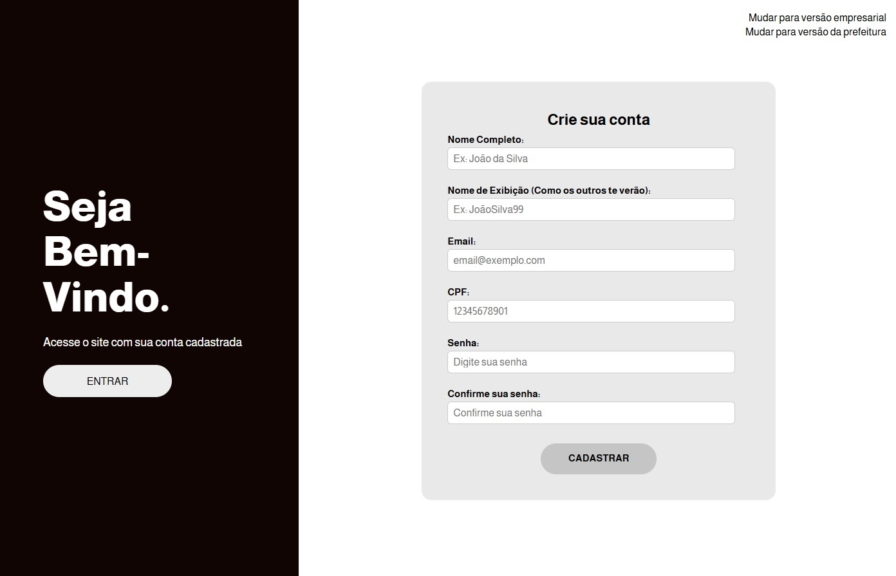


##### Login de Usuário da População

Página que possibilita o login de um membro da população, usando o CPF e a senha utilizados no cadastro.

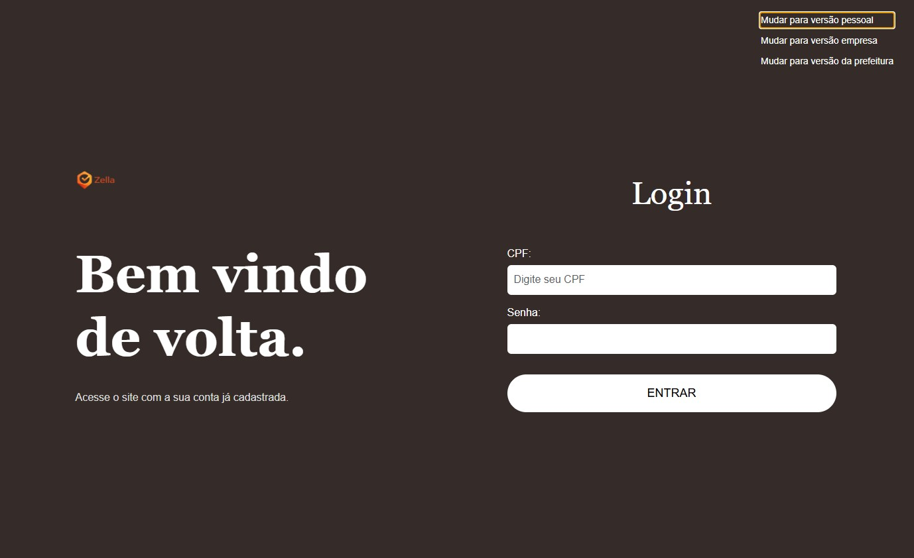

##### HomePage População

Página inicial após cadastro/login do membro da população, mostrando o mapa interativo, denúncias e quantitativos sobre as denúncias e usuários cadastrados.

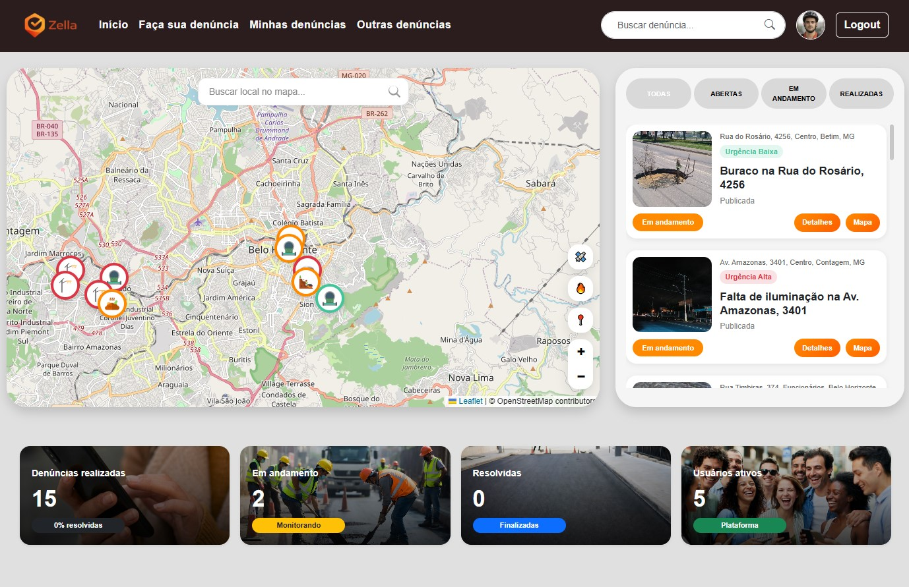

##### Criação de Denúncia

Página para a criação de uma denúncia, onde o usuário pode adicionar fotos, descrição e informações relacionadas à denúncia, como a categoria, localização, urgência e entidade direcionada.

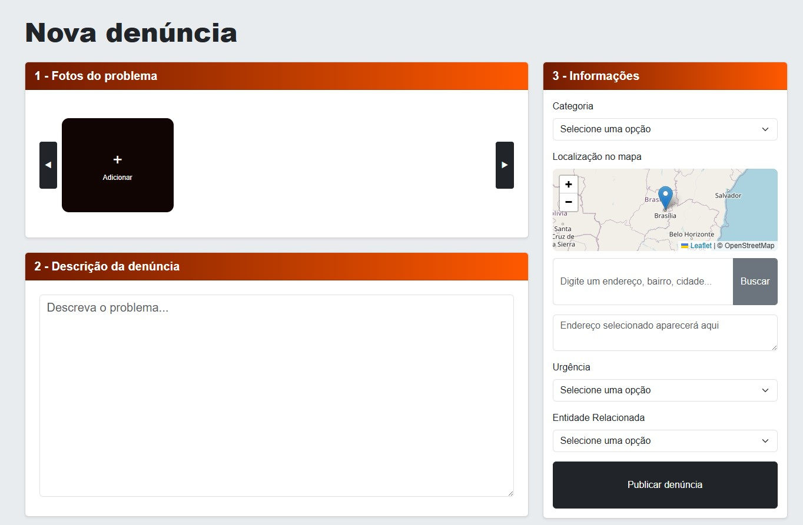

##### Opções de Categoria

Opções de categoria na criação da denúncia.

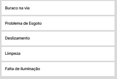

##### Opções de Entidade Direcionada

Opções de entidade direcionada na criação da denúncia.

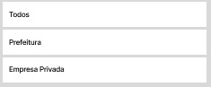

##### Opções de Urgência

Opções de urgência na criação da denúncia.

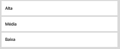

##### Outras Denúncias

Página de exibição das demais denúncias, com opção de filtrar por data, categoria e urgência, além de possibilitar a busca pelo nome da denúncia.

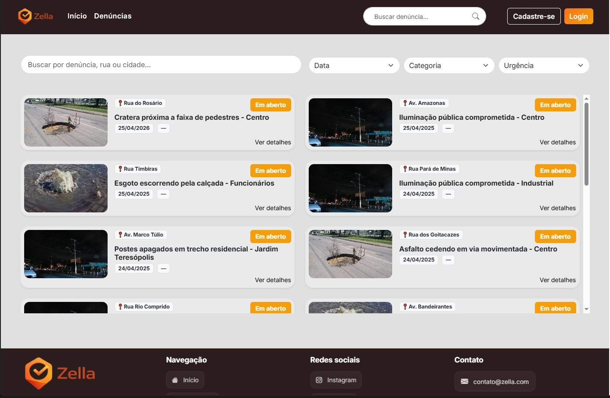

##### Filtragem por Categoria

Opções de filtragem da denúncia por categoria.

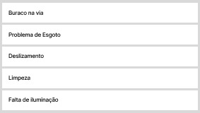

##### Filtragem por Data

Opções de filtragem da denúncia por data.

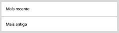

##### Filtragem por Urgência

Opções de filtragem da denúncia pela urgência.

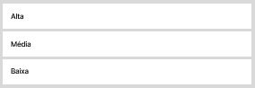

##### Perfil de Usuário

Página para exibir o perfil de um usuário membro da população, mostrando o histórico de denúncias que o usuário se envolveu, além de exibir as demandas atendidas, em aberto, atualizações em suas denúncias e sua pontuação no site.

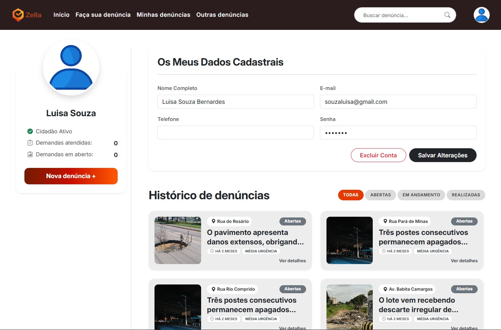

##### Detalhes da Denúncia

Página para exibir informações detalhadas sobre uma denúncia, exibindo o andamento, fotos, descrição da denúncia, categorias, órgão responsável, denunciante, etc. Além disso, a página possui uma seção de comentários que possibilita o diálogo entre os moradores afetados, e também possui um chat porta-voz que estabelece a relação entre o morador e o representante da entidade envolvida na denúncia.

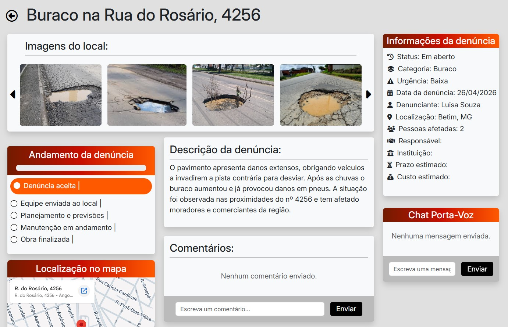

##### Cadastro Empresa

Página que possibilita cadastro de uma empresa, usando nome, email, CNPJ e uma senha.

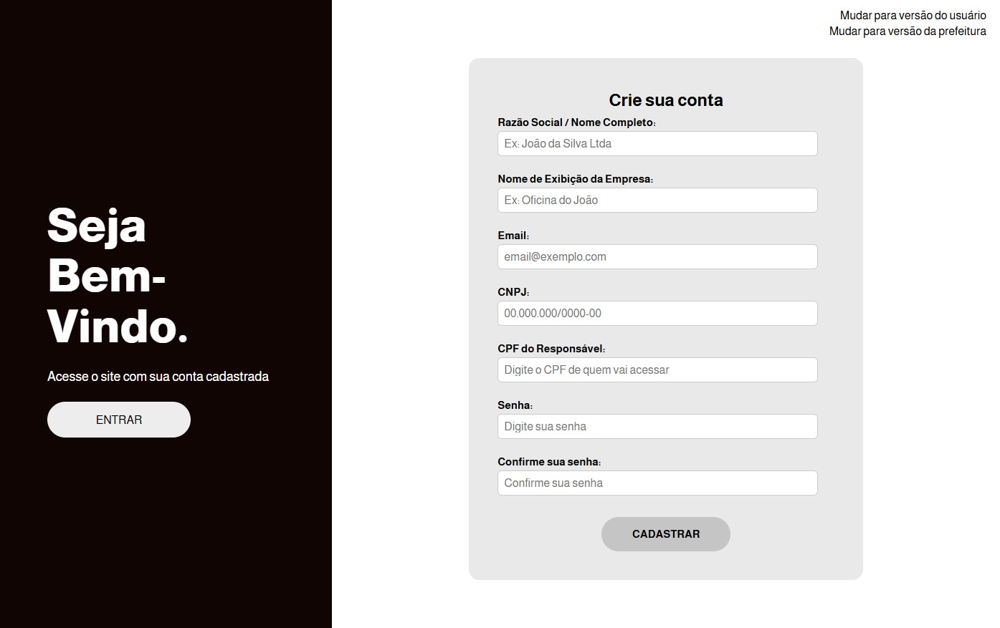

##### Login de Usuário da Empresa

Página de login de um funcionário da empresa por meio de CNPJ e senha cadastrados.

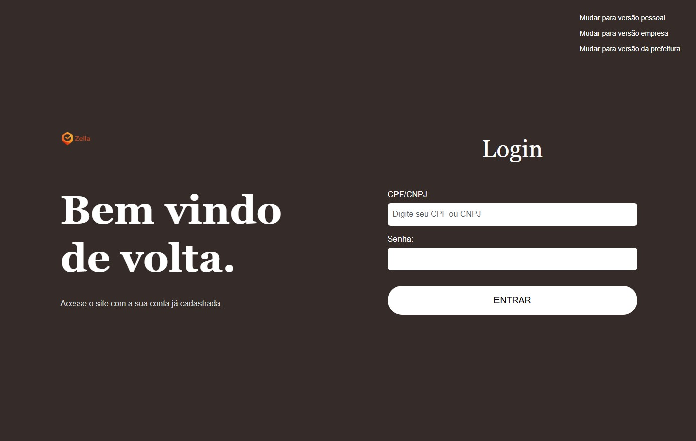

##### HomePage Empresa

Página inicial após cadastro/login do membro da empresa, mostrando o mapa interativo, denúncias e quantitativos sobre as denúncias e usuários cadastrados.

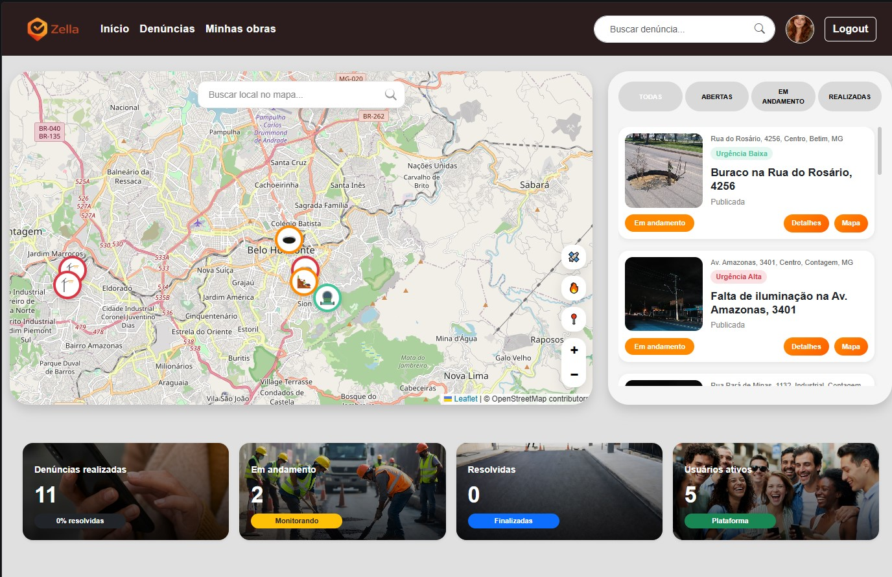

##### Outras Denúncias Empresa

Página de exibição das demais denúncias, com opção de filtrar por data, categoria e urgência, além de possibilitar a busca pelo nome da denúncia.


##### Detalhes da Denúncia Empresa

Página para exibir informações detalhadas sobre uma denúncia incluindo a descrição, comentários, fotos, órgão responsável, local, e demais informações. A página possibilita que o membro da empresa edite o andamento da denúncia, dialogue com membros da população envolvidos na denúncia e também permite que ele edite informações relacionadas à empresa na denúncia.

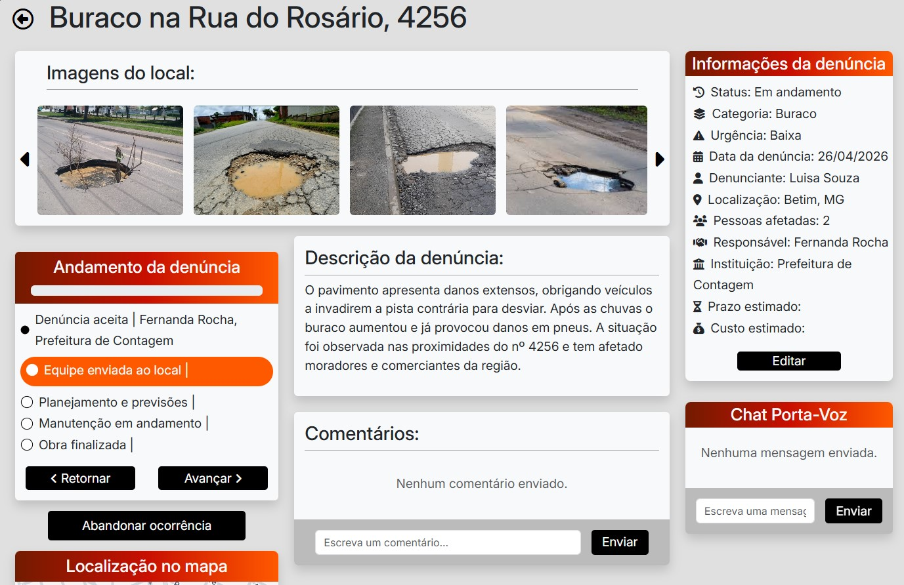

##### Perfil Empresa

Página para exibir o perfil de um usuário membro da empresa, mostrando o nome da empresa, denúncias solucionadas, obras em andamento e avaliações recebidas pelos usuários.

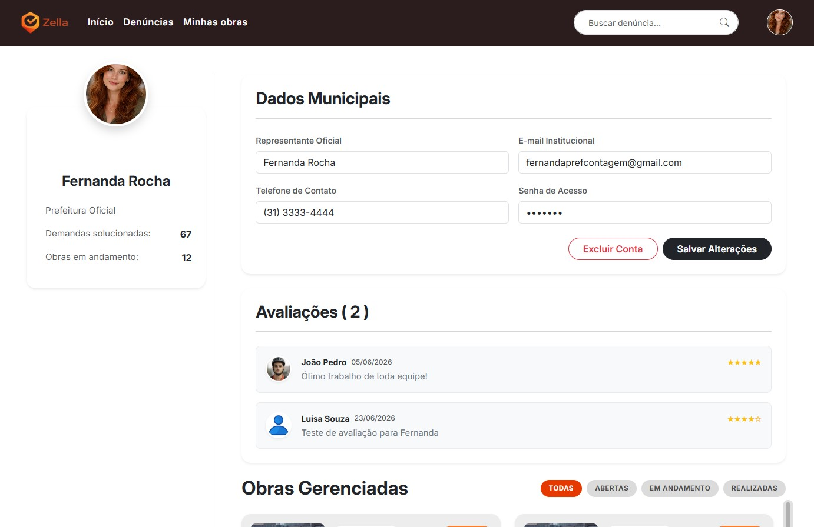

##### Editor de Informações da Denúncia

Tela que permite que o membro da empresa adicione uma nota à denúncia, novos checkpoints conforme a necessidade da empresa, altere o curso estimado e também o prazo estimado da conclusão da obra.

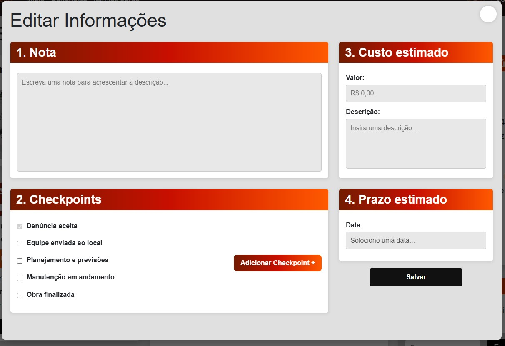

##### Cadastro Prefeitura

Página que possibilita cadastro de uma prefeitura, usando nome, email, município e uma senha.

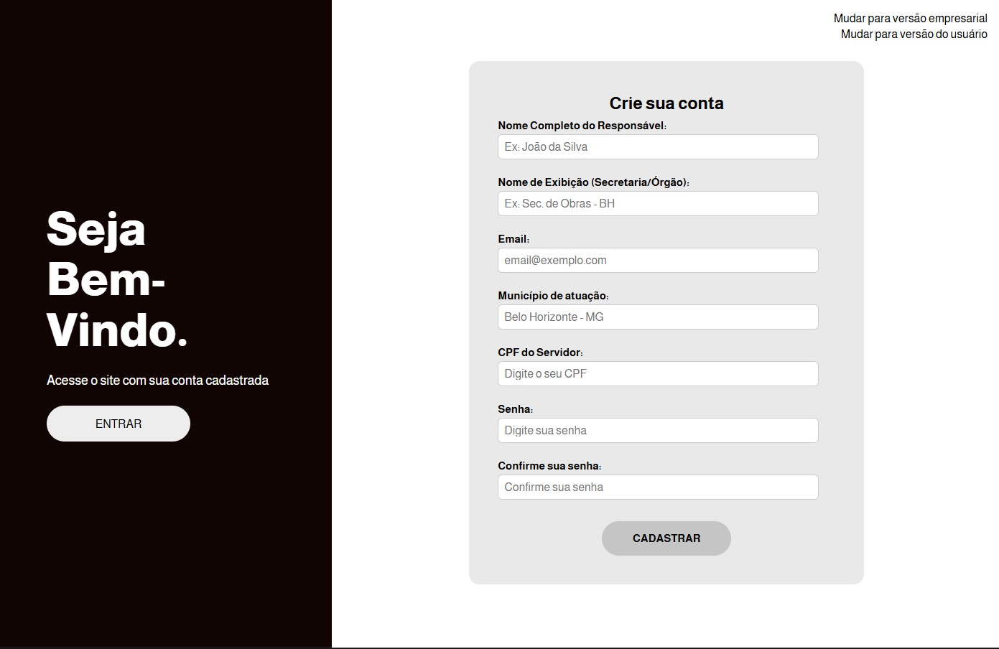

##### Login de Usuário da Prefeitura

Página de login de um funcionário da prefeitura por meio do município e senha cadastrados.

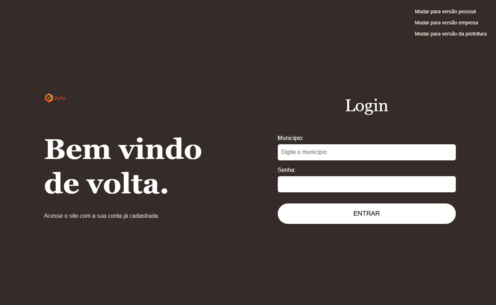

##### Outras Denúncias Prefeitura

Página de exibição das demais denúncias, com opção de filtrar por data, categoria e urgência, além de possibilitar a busca pelo nome da denúncia.


##### Detalhes da Denúncia Prefeitura

Página para exibir informações detalhadas sobre uma denúncia incluindo a descrição, comentários, fotos, órgão responsável, local, e demais informações. A página possibilita que o membro da prefeitura edite o andamento da denúncia, dialogue com membros da população envolvidos na denúncia e também permite que ele edite informações relacionadas à prefeitura na denúncia.


##### HomePage Prefeitura

Página inicial após cadastro/login do membro da prefeitura, mostrando o mapa interativo, denúncias e quantitativos sobre as denúncias e usuários cadastrados.


##### Perfil Prefeitura

Página para exibir o perfil de um usuário membro da prefeitura, mostrando o município da prefeitura, denúncias solucionadas, obras em andamento e avaliações recebidas pelos usuários.


##### Editor Prefeitura

Tela que permite que o membro da prefeitura adicione uma nota à denúncia, novos checkpoints conforme a necessidade prefeitura, altere o curso estimado e também o prazo estimado da conclusão da obra.


### User Flow

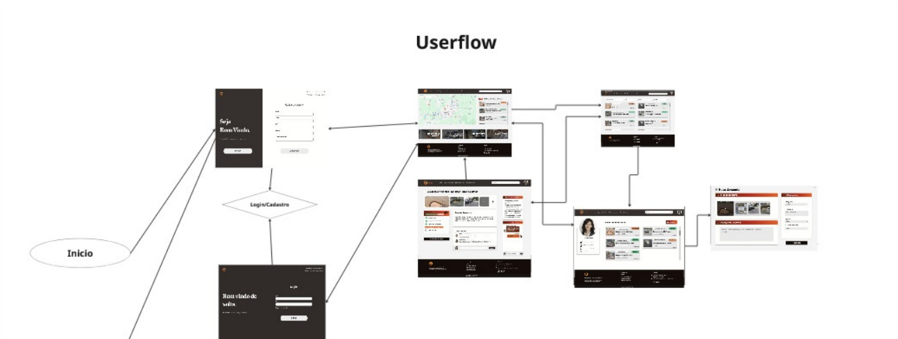
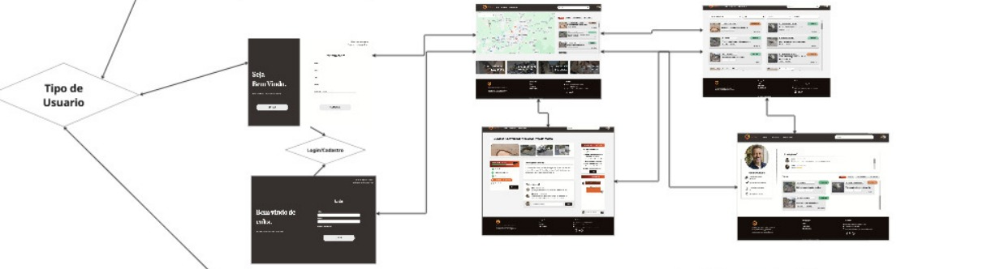
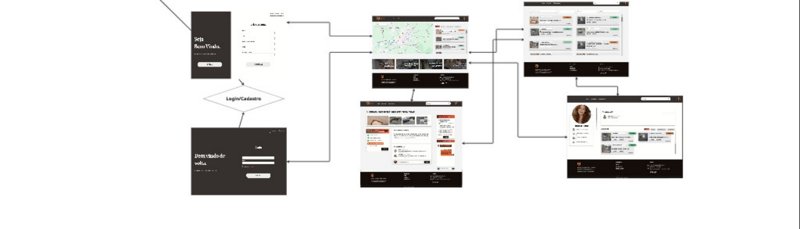

### Protótipo Interativo

✅ [Protótipo Interativo (Figma)](https://www.figma.com/proto/FIEmOBz2bmTWoPy2U3CFam/Zella?node-id=1-334&t=MR2BjRzAHsF5PjPY-1)


# Metodologia

O desenvolvimento do projeto foi realizado de forma colaborativa ao longo de várias semanas, por meio de reuniões entre os integrantes do grupo. Durante esses encontros, as ideias foram discutidas em conjunto, permitindo a troca de diferentes pontos de vista e a construção coletiva das soluções propostas.
A equipe adotou uma abordagem baseada em princípios do Design Thinking, passando por etapas como entendimento do problema, levantamento de hipóteses, validação por meio de entrevistas e organização das informações coletadas. Esse processo contribuiu para uma melhor compreensão das necessidades dos usuários e dos desafios relacionados à infraestrutura urbana.
De modo geral, não houve uma divisão rígida de tarefas, sendo que todos os integrantes participaram ativamente das diferentes etapas do projeto. No entanto, ocorreu uma divisão pontual das atividades: uma parte da equipe (Gabriel, Giovanna, Gustavo e Warlley) ficou responsável pela elaboração do userflow, estruturando a jornada do usuário dentro do sistema, enquanto outra parte (Bernado, Rafael e Sophia) se dedicou à organização e desenvolvimento da apresentação do projeto.
Essa dinâmica colaborativa, aliada a uma divisão estratégica em momentos específicos, favoreceu a produtividade da equipe, o alinhamento das ideias e a evolução no projeto.


## Ferramentas

Relação de ferramentas empregadas pelo grupo durante o projeto.

| Ambiente                              | Plataforma                                                                  | Link de acesso |
| ------------------------------------- | --------------------------------------------------------------------------- | -------------- |
| Processo de Design Thinking           | [Miro](https://miro.com)                            | [Miro](https://miro.com/app/board/uXjVGttxm6w=/?share_link_id=405329199487)                 |
| Protótipo Interativo                  | [Figma](https://www.figma.com)                      | [Figma](https://www.figma.com/design/FIEmOBz2bmTWoPy2U3CFam/Zella?node-id=1-334&t=ebuhRgCYjVZYXVko-1)              |
| User Flow e Wireframes                | [Figma](https://www.figma.com)                      | [Figma]( https://www.figma.com/design/FIEmOBz2bmTWoPy2U3CFam/Zella?node-id=1-334&t=ebuhRgCYjVZYXVko-1)              |
| Design de Slides e Apresentações      | [Canva](https://www.canva.com)                      | [Canva](https://www.canva.com)                |
| Canal de Comunicação                  | [Google Meet](https://meet.google.com)              | [Google Meet](https://meet.google.com)                  |
| Ambiente de Desenvolvimento           | [Visual Studio Code](https://code.visualstudio.com) | [Visual Studio Code](https://code.visualstudio.com)     |
| Hospedagem de Projeto e Versionamento | [GitHub](https://github.com)                        | [GitHub](https://github.com/ICEI-PUC-Minas-PMGES-TI/pmg-es-2026-1-ti1-0438100-nexo-2)   |

### Justificativa das ferramentas utilizadas

* **Miro:** utilizado para a aplicação do processo de Design Thinking, permitindo a colaboração em equipe na criação de ideias, organização de fluxos e definição de requisitos do projeto.

* **Figma:** escolhido para a criação do protótipo interativo, wireframes e user flows.

* **Canva:** utilizado para a produção dos slides e apresentações do projeto.

* **Google Meet:** empregado como principal ferramenta de comunicação entre os integrantes do grupo.

* **Visual Studio Code:** utilizado como editor de código devido à sua leveza, suporte a múltiplas linguagens, extensões e integração com ferramentas de desenvolvimento.

* **GitHub:** utilizado para hospedagem do projeto e controle de versionamento, permitindo colaboração entre os integrantes, organização do código e acompanhamento das alterações realizadas.


## Gerenciamento do Projeto

Divisão de papéis no grupo e apresentação da estrutura da ferramenta de controle de tarefas (Kanban).


# Solução Implementada

Esta seção apresenta todos os detalhes da solução criada no projeto.

## Vídeo do Projeto

O vídeo a seguir traz uma apresentação do problema que a equipe está tratando e a proposta de solução. ⚠️ EXEMPLO ⚠️

[](./images/Video_Solucao_Zella.mp4)

# Funcionalidades

Esta seção apresenta as funcionalidades das principais páginas da plataforma Zella, incluindo HomePage, Cadastro de Usuário, Perfil do Usuário, Outras Denúncias, Detalhes da Denúncia, Edição de Denúncias e Cadastro de Denúncias.

---

# Funcionalidades da HomePage

A HomePage é responsável pela visualização das denúncias urbanas, navegação no mapa interativo e acesso rápido às principais informações da plataforma.

---

##### Funcionalidade 1 - Mapa Interativo

 Permite a visualização das denúncias urbanas em um mapa dinâmico e interativo, facilitando a identificação dos problemas registrados pela população.

* **Estrutura de dados:**

```json
{
  "denuncias":[
        {
            "id": 1,
            "status_id": 2,
            "categoria_id": 1,
            "descricaoDenuncia": "Há aproximadamente duas semanas surgiu um buraco de grandes proporções no cruzamento desta via, causando transtornos constantes para motoristas, motociclistas e pedestres que passam pelo local diariamente. O asfalto está cedendo cada vez mais, principalmente após períodos de chuva, aumentando o risco de acidentes e danos aos veículos. Durante a noite o problema se torna ainda mais perigoso devido à baixa iluminação da rua, dificultando a visualização do buraco a tempo de desviar.",
            "imagens": ["imgs/buraco1.jpg", "imgs/buraco2.jpg", "imgs/buraco3.jpg", "imgs/buraco4.jpg", "imgs/buraco1.jpg", "imgs/buraco2.jpg", "imgs/buraco3.jpg", "imgs/buraco4.jpg"],
            "urgencia_id": 1,
            "data": "2026-04-26",
            "entidade_id": 1,
            "usuarioMorador_cpf": 12345678900,      
            "local": {
                "cidade": "Contagem",
                "estado": "MG",
                "pais": "Brasil",
                "logradouro": "Avenida Firmo de Matos",
                "numero": 148,
                "latitude": -19.9316,
                "longitude": -44.0539
            },
            "usuarioInstituicao_cpf": 98723456700,
            "notaOrgao": "Além das chuvas, os buracos ocorrem devido à pessima qualidade do asfalto... estamos agilizando para resolver isso.",
            "prazo": "12/05/2026",
            "afetados": 21,
            "custo": "R$ 987,95",
            "progresso": [
                {"etapa": "Denúncia aceita", "concluida": false, "arquivo": [{"nome": "", "url": ""}]},
                {"etapa": "Equipe enviada ao local", "concluida": false, "arquivo": {"nome": "teste", "url": "files/arquivo_teste.txt"}},
                {"etapa": "Planejamento e previsões", "concluida": false, "arquivo": {"nome": "teste", "url": "files/arquivo_teste.txt"}},
                {"etapa": "Manutenção em andamento", "concluida": false, "arquivo": {"nome": "teste", "url": "files/arquivo_teste.txt"}},
                {"etapa": "Obra finalizada", "concluida": false, "arquivo": {"nome": "teste", "url": "files/arquivo_teste.txt"}}
            ]
        },
          ],
}
````

* **Instruções de acesso:**

  * Abra a HomePage da plataforma
  * Permita o acesso à localização do navegador
  * Visualize as denúncias distribuídas no mapa
  * Utilize os controles laterais para:
  * Alternar entre mapa padrão e satélite
  * Retornar para a localização atual

* **Tela da funcionalidade**:

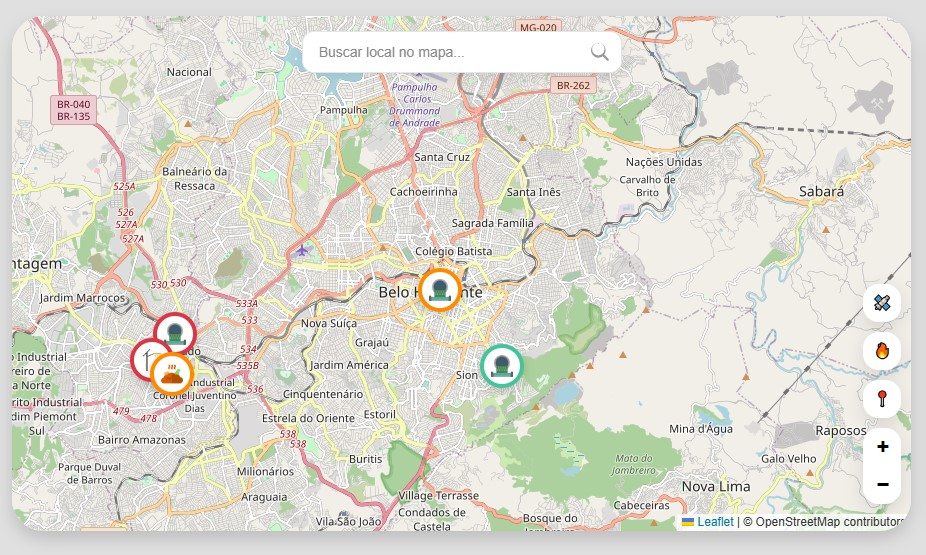

---

##### Funcionalidade 2 - Atalhos para Denúncias

Permite acesso rápido às denúncias através de cards dinâmicos com informações resumidas e ações rápidas.

* **Estrutura de dados:**

```json
{
    "denuncias":[
        {
            "id": 1,
            "status_id": 2,
            "categoria_id": 1,
            "descricaoDenuncia": "Há aproximadamente duas semanas surgiu um buraco de grandes proporções no cruzamento desta via, causando transtornos constantes para motoristas, motociclistas e pedestres que passam pelo local diariamente. O asfalto está cedendo cada vez mais, principalmente após períodos de chuva, aumentando o risco de acidentes e danos aos veículos. Durante a noite o problema se torna ainda mais perigoso devido à baixa iluminação da rua, dificultando a visualização do buraco a tempo de desviar.",
            "imagens": ["imgs/buraco1.jpg", "imgs/buraco2.jpg", "imgs/buraco3.jpg", "imgs/buraco4.jpg", "imgs/buraco1.jpg", "imgs/buraco2.jpg", "imgs/buraco3.jpg", "imgs/buraco4.jpg"],
            "urgencia_id": 1,
            "data": "2026-04-26",
            "entidade_id": 1,
            "usuarioMorador_cpf": 12345678900,      
            "local": {
                "cidade": "Contagem",
                "estado": "MG",
                "pais": "Brasil",
                "logradouro": "Avenida Firmo de Matos",
                "numero": 148,
                "latitude": -19.9316,
                "longitude": -44.0539
            },
            "usuarioInstituicao_cpf": 98723456700,
            "notaOrgao": "Além das chuvas, os buracos ocorrem devido à pessima qualidade do asfalto... estamos agilizando para resolver isso.",
            "prazo": "12/05/2026",
            "afetados": 21,
            "custo": "R$ 987,95",
            "progresso": [
                {"etapa": "Denúncia aceita", "concluida": false, "arquivo": [{"nome": "", "url": ""}]},
                {"etapa": "Equipe enviada ao local", "concluida": false, "arquivo": {"nome": "teste", "url": "files/arquivo_teste.txt"}},
                {"etapa": "Planejamento e previsões", "concluida": false, "arquivo": {"nome": "teste", "url": "files/arquivo_teste.txt"}},
                {"etapa": "Manutenção em andamento", "concluida": false, "arquivo": {"nome": "teste", "url": "files/arquivo_teste.txt"}},
                {"etapa": "Obra finalizada", "concluida": false, "arquivo": {"nome": "teste", "url": "files/arquivo_teste.txt"}}
            ]
        },
          ],

    "status":[
        {"id": 1, "status": "Concluída"},
        {"id": 2, "status": "Em andamento"},
        {"id": 3, "status": "Em aberto"},
        {"id": 4, "status": "Obra finalizada"}
    ],
}
```

* **Instruções de acesso:**

  * Acesse a sidebar lateral
  * Navegue pela lista de denúncias disponíveis
  * Clique em “Detalhes” para acessar informações completas da denúncia
  * Clique em “Mapa” para localizar a denúncia diretamente no mapa
  * Utilize os filtros para separar denúncias: Abertas, Em andamento ou Resolvidas

* **Tela da funcionalidade**:

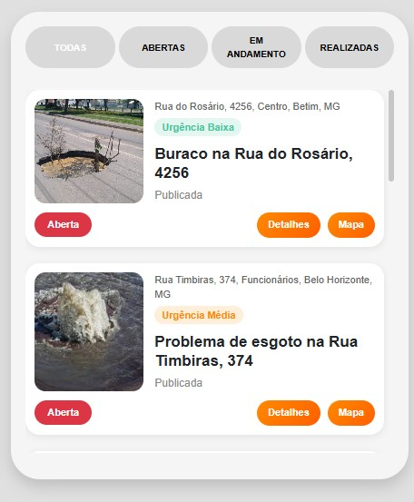

---

##### Funcionalidade 3 - Busca e Direcionamentos

Permite pesquisar endereços e localizar regiões específicas diretamente no mapa da plataforma.

* **Estrutura de dados:**

```json
{
"denuncias":[
        {
            "id": 1,
            "status_id": 2,
            "categoria_id": 1,
            "descricaoDenuncia": "Há aproximadamente duas semanas surgiu um buraco de grandes proporções no cruzamento desta via, causando transtornos constantes para motoristas, motociclistas e pedestres que passam pelo local diariamente. O asfalto está cedendo cada vez mais, principalmente após períodos de chuva, aumentando o risco de acidentes e danos aos veículos. Durante a noite o problema se torna ainda mais perigoso devido à baixa iluminação da rua, dificultando a visualização do buraco a tempo de desviar.",
            "imagens": ["imgs/buraco1.jpg", "imgs/buraco2.jpg", "imgs/buraco3.jpg", "imgs/buraco4.jpg", "imgs/buraco1.jpg", "imgs/buraco2.jpg", "imgs/buraco3.jpg", "imgs/buraco4.jpg"],
            "urgencia_id": 1,
            "data": "2026-04-26",
            "entidade_id": 1,
            "usuarioMorador_cpf": 12345678900,      
            "local": {
                "cidade": "Contagem",
                "estado": "MG",
                "pais": "Brasil",
                "logradouro": "Avenida Firmo de Matos",
                "numero": 148,
                "latitude": -19.9316,
                "longitude": -44.0539
            },
            "usuarioInstituicao_cpf": 98723456700,
            "notaOrgao": "Além das chuvas, os buracos ocorrem devido à pessima qualidade do asfalto... estamos agilizando para resolver isso.",
            "prazo": "12/05/2026",
            "afetados": 21,
            "custo": "R$ 987,95",
            "progresso": [
                {"etapa": "Denúncia aceita", "concluida": false, "arquivo": [{"nome": "", "url": ""}]},
                {"etapa": "Equipe enviada ao local", "concluida": false, "arquivo": {"nome": "teste", "url": "files/arquivo_teste.txt"}},
                {"etapa": "Planejamento e previsões", "concluida": false, "arquivo": {"nome": "teste", "url": "files/arquivo_teste.txt"}},
                {"etapa": "Manutenção em andamento", "concluida": false, "arquivo": {"nome": "teste", "url": "files/arquivo_teste.txt"}},
                {"etapa": "Obra finalizada", "concluida": false, "arquivo": {"nome": "teste", "url": "files/arquivo_teste.txt"}}
            ]
        },
          ],
}
```

* **Instruções de acesso:**

  * Utilize a barra de busca acima do mapa
  * Digite um endereço, rua ou cidade
  * Pressione ENTER ou clique na lupa
  * O mapa será direcionado automaticamente para a localização pesquisada

* **Tela da funcionalidade**:


---


# Funcionalidades da Tela de Cadastro de Usuário

A tela de Cadastro de Usuário permite que cidadãos realizem o registro na plataforma e acessem rapidamente o sistema.

---

##### Funcionalidade 4 - Painel de Boas-Vindas e Acesso

Permite que usuários que já possuem um perfil cadastrado no sistema naveguem rapidamente para a área de login.

* **Estrutura de dados:**

```json
{
    "usuario_atual": {
        "nome": "Luiza Souza",
        "status_sessao": "autenticado"
    },

    "destino_redirecionamento": "login.html"
}
```

* **Instruções de acesso:**

  * Visualize o painel lateral de boas-vindas
  * Clique no botão “ENTRAR”
  * O sistema redirecionará para login

* **Tela da funcionalidade**:


---

##### Funcionalidade 5 - Seleção de Perfil Corporativo/Governamental

Permite alternar o fluxo de cadastro caso o usuário não seja um cidadão comum (Pessoa Física), direcionando para os formulários de empresas ou prefeituras.

* **Estrutura de dados:**

```json
{
    "opcoes_perfil": [
        {
            "tipo": "Empresarial"
        },
        {
            "tipo": "Prefeitura"
        }
    ]
}
```

* **Instruções de acesso:**

  * Localize os links superiores da tela
  * Clique em:

    * “Versão empresarial”
    * “Versão prefeitura”
  * O sistema abrirá o formulário correspondente

* **Tela da funcionalidade**:


---

##### Funcionalidade 6 - Formulário e Submissão de Cadastro

Permite criar uma nova conta de cidadão na plataforma.

* **Estrutura de dados:**

```json
{
    "campos_formulario": {
        "nome_completo": "string",
        "email": "string",
        "cpf": "number",
        "senha": "password",
        "confirmar_senha": "password"
    }
}
```

* **Instruções de acesso:**

  * Preencha:

    * Nome
    * Email
    * CPF
    * Senha
    * Confirmar senha
  * Clique em “CADASTRAR”

* **Tela da funcionalidade**:


---

# Funcionalidades da Tela de Perfil do Usuário

A tela de Perfil do Usuário apresenta estatísticas pessoais e histórico de denúncias.

---

##### Funcionalidade 7 - Exibição de Perfil e Estatísticas

Apresenta de forma consolidada os dados do usuário logado, junto com suas métricas de engajamento na plataforma (pontuação e status de demandas).

* **Estrutura de dados:**

```json
{
    "usuario": {
        "nome": "Luiza Souza",

        "estatisticas": [
            {
                "label": "Atendidas",
                "valor": 3
            },
            {
                "label": "Em aberto",
                "valor": 2
            },
            {
                "label": "Pontos",
                "valor": 50
            }
        ]
    }
}
```

* **Instruções de acesso:**

  * Acesse o painel lateral ou cabeçalho da página de histórico.
  * Visualize seu nome, foto de perfil e o bloco de estatísticas com o resumo das suas atividades e pontuação acumulada.

* **Tela da funcionalidade**:


---

##### Funcionalidade 8 - Filtragem do Histórico de Ocorrências

Disponibiliza abas interativas para que o usuário filtre a listagem de suas denúncias conforme o andamento atual.

* **Estrutura de dados:**

```json
{
    "filtros": [
        "TODAS",
        "ABERTAS",
        "EM ANDAMENTO",
        "REALIZADAS"
    ]
}
```

* **Instruções de acesso:**

  * Navegue até o topo da seção "Histórico de denúncias".
  * Clique sobre uma das abas desejadas: TODAS, ABERTAS, EM ANDAMENTO ou REALIZADAS.
  * A listagem abaixo será atualizada exibindo apenas os cards correspondentes ao filtro aplicado.

* **Tela da funcionalidade**:


---

##### Funcionalidade 9 - Listagem de Cards de Denúncias

Exibe as denúncias enviadas pelo usuário em formato de cartões resumidos, permitindo a rolagem vertical e o direcionamento para os detalhes completos da ocorrência.

* **Estrutura de dados:**

```json
{
    "denuncias": [
        {
            "titulo": "Buracos na Avenida Firmo de Matos",
            "local": "Avenida Firmo de Matos",
            "status": "Em andamento",
            "urgencia": "Alta"
        }
    ]
}
```

* **Instruções de acesso:**

  * Role a página verticalmente para visualizar todas as suas postagens.
  * Identifique o título, endereço, foto ilustrativa e a tag colorida indicando o status (ex: Resolvido, Em andamento).
  * Clique no botão "Ver detalhes" presente em qualquer card para abrir a página informativa detalhada daquela denúncia específica.

* **Tela da funcionalidade**:


---

# Funcionalidades da Página de Outras Denúncias

Permite visualizar denúncias cadastradas por outros usuários.

---

##### Funcionalidade 10 - Listagem de Todas as Denúncias

Permite visualizar denúncias cadastradas na plataforma.

* **Estrutura de dados:**

```json
{
   "denuncias":[
        {
            "id": 1,
            "status_id": 2,
            "categoria_id": 1,
            "descricaoDenuncia": "Há aproximadamente duas semanas surgiu um buraco de grandes proporções no cruzamento desta via, causando transtornos constantes para motoristas, motociclistas e pedestres que passam pelo local diariamente. O asfalto está cedendo cada vez mais, principalmente após períodos de chuva, aumentando o risco de acidentes e danos aos veículos. Durante a noite o problema se torna ainda mais perigoso devido à baixa iluminação da rua, dificultando a visualização do buraco a tempo de desviar.",
            "imagens": ["imgs/buraco1.jpg", "imgs/buraco2.jpg", "imgs/buraco3.jpg", "imgs/buraco4.jpg", "imgs/buraco1.jpg", "imgs/buraco2.jpg", "imgs/buraco3.jpg", "imgs/buraco4.jpg"],
            "urgencia_id": 1,
            "data": "2026-04-26",
            "entidade_id": 1,
            "usuarioMorador_cpf": 12345678900,      
            "local": {
                "cidade": "Contagem",
                "estado": "MG",
                "pais": "Brasil",
                "logradouro": "Avenida Firmo de Matos",
                "numero": 148,
                "latitude": -19.9316,
                "longitude": -44.0539
            },
            "usuarioInstituicao_cpf": 98723456700,
            "notaOrgao": "Além das chuvas, os buracos ocorrem devido à pessima qualidade do asfalto... estamos agilizando para resolver isso.",
            "prazo": "12/05/2026",
            "afetados": 21,
            "custo": "R$ 987,95",
            "progresso": [
                {"etapa": "Denúncia aceita", "concluida": false, "arquivo": [{"nome": "", "url": ""}]},
                {"etapa": "Equipe enviada ao local", "concluida": false, "arquivo": {"nome": "teste", "url": "files/arquivo_teste.txt"}},
                {"etapa": "Planejamento e previsões", "concluida": false, "arquivo": {"nome": "teste", "url": "files/arquivo_teste.txt"}},
                {"etapa": "Manutenção em andamento", "concluida": false, "arquivo": {"nome": "teste", "url": "files/arquivo_teste.txt"}},
                {"etapa": "Obra finalizada", "concluida": false, "arquivo": {"nome": "teste", "url": "files/arquivo_teste.txt"}}
            ]
        }
          ],

    "status":[
        {"id": 1, "status": "Concluída"},
        {"id": 2, "status": "Em andamento"},
        {"id": 3, "status": "Em aberto"},
        {"id": 4, "status": "Obra finalizada"}
    ],
}
```

* **Instruções de acesso:**

  * Acesse “Outras Denúncias”
  * Navegue pela listagem
  * Clique em “Detalhes”

* **Tela da funcionalidade**:


---

##### Funcionalidade 11 - Busca e Filtragem de Denúncias

Permite aplicar filtros nas denúncias.

* **Estrutura de dados:**

```json
{
     "denuncias":[
        {
            "id": 1,
            "status_id": 2,
            "categoria_id": 1,
            "descricaoDenuncia": "Há aproximadamente duas semanas surgiu um buraco de grandes proporções no cruzamento desta via, causando transtornos constantes para motoristas, motociclistas e pedestres que passam pelo local diariamente. O asfalto está cedendo cada vez mais, principalmente após períodos de chuva, aumentando o risco de acidentes e danos aos veículos. Durante a noite o problema se torna ainda mais perigoso devido à baixa iluminação da rua, dificultando a visualização do buraco a tempo de desviar.",
            "imagens": ["imgs/buraco1.jpg", "imgs/buraco2.jpg", "imgs/buraco3.jpg", "imgs/buraco4.jpg", "imgs/buraco1.jpg", "imgs/buraco2.jpg", "imgs/buraco3.jpg", "imgs/buraco4.jpg"],
            "urgencia_id": 1,
            "data": "2026-04-26",
            "entidade_id": 1,
            "usuarioMorador_cpf": 12345678900,      
            "local": {
                "cidade": "Contagem",
                "estado": "MG",
                "pais": "Brasil",
                "logradouro": "Avenida Firmo de Matos",
                "numero": 148,
                "latitude": -19.9316,
                "longitude": -44.0539
            },
            "usuarioInstituicao_cpf": 98723456700,
            "notaOrgao": "Além das chuvas, os buracos ocorrem devido à pessima qualidade do asfalto... estamos agilizando para resolver isso.",
            "prazo": "12/05/2026",
            "afetados": 21,
            "custo": "R$ 987,95",
            "progresso": [
                {"etapa": "Denúncia aceita", "concluida": false, "arquivo": [{"nome": "", "url": ""}]},
                {"etapa": "Equipe enviada ao local", "concluida": false, "arquivo": {"nome": "teste", "url": "files/arquivo_teste.txt"}},
                {"etapa": "Planejamento e previsões", "concluida": false, "arquivo": {"nome": "teste", "url": "files/arquivo_teste.txt"}},
                {"etapa": "Manutenção em andamento", "concluida": false, "arquivo": {"nome": "teste", "url": "files/arquivo_teste.txt"}},
                {"etapa": "Obra finalizada", "concluida": false, "arquivo": {"nome": "teste", "url": "files/arquivo_teste.txt"}}
            ]
        }
          ],

    "status":[
        {"id": 1, "status": "Concluída"},
        {"id": 2, "status": "Em andamento"},
        {"id": 3, "status": "Em aberto"},
        {"id": 4, "status": "Obra finalizada"}
    ],

}
```

* **Instruções de acesso:**

  * Utilize os filtros superiores
  * Filtre por:

    * Nome
    * Status
    * Data
    * Tipo

* **Tela da funcionalidade**:


---

# Funcionalidades da Página de Detalhes da Denúncia

Apresenta informações completas relacionadas à denúncia.

---

##### Funcionalidade 12 - Visualização Completa da Denúncia

Permite a visualização de todas as informações da denúncia, desde categoria, urgência, imagens, localização exata no mapa, entre outros. Também permite a visualização do progresso da denúncia, avanço de etapas (se usuário do tipo instituição) e interação entre usuários por meio dos comentários e do chat porta-voz.

* **Estrutura de dados:**

```json
{
    "denuncias":[
        {
            "id": 1,
            "status_id": 2,
            "categoria_id": 1,
            "descricaoDenuncia": "Há aproximadamente duas semanas surgiu um buraco de grandes proporções no cruzamento desta via, causando transtornos constantes para motoristas, motociclistas e pedestres que passam pelo local diariamente. O asfalto está cedendo cada vez mais, principalmente após períodos de chuva, aumentando o risco de acidentes e danos aos veículos. Durante a noite o problema se torna ainda mais perigoso devido à baixa iluminação da rua, dificultando a visualização do buraco a tempo de desviar.",
            "imagens": ["imgs/buraco1.jpg", "imgs/buraco2.jpg", "imgs/buraco3.jpg", "imgs/buraco4.jpg", "imgs/buraco1.jpg", "imgs/buraco2.jpg", "imgs/buraco3.jpg", "imgs/buraco4.jpg"],
            "urgencia_id": 1,
            "data": "2026-04-26",
            "entidade_id": 1,
            "usuarioMorador_cpf": 12345678900,      
            "local": {
                "cidade": "Contagem",
                "estado": "MG",
                "pais": "Brasil",
                "logradouro": "Avenida Firmo de Matos",
                "numero": 148,
                "latitude": -19.9316,
                "longitude": -44.0539
            },
            "usuarioInstituicao_cpf": 98723456700,
            "notaOrgao": "Além das chuvas, os buracos ocorrem devido à pessima qualidade do asfalto... estamos agilizando para resolver isso.",
            "prazo": "12/05/2026",
            "afetados": 21,
            "custo": "R$ 987,95",
            "progresso": [
                {"etapa": "Denúncia aceita", "concluida": false, "arquivo": [{"nome": "", "url": ""}]},
                {"etapa": "Equipe enviada ao local", "concluida": false, "arquivo": {"nome": "teste", "url": "files/arquivo_teste.txt"}},
                {"etapa": "Planejamento e previsões", "concluida": false, "arquivo": {"nome": "teste", "url": "files/arquivo_teste.txt"}},
                {"etapa": "Manutenção em andamento", "concluida": false, "arquivo": {"nome": "teste", "url": "files/arquivo_teste.txt"}},
                {"etapa": "Obra finalizada", "concluida": false, "arquivo": {"nome": "teste", "url": "files/arquivo_teste.txt"}}
            ]
        },
          ],

    "usuarioMorador":[
        {
            "nome_usuario":"Luisa Souza",
            "nome_completo": "Luisa Souza Bernardes",
            "email": "souzaluisa@gmail.com",
            "cpf": 12345678900,
            "senha": "xyz123!"  
        }
    ],


    "usuarioInstituicao":[
        {
            "instituicao_id": 2,
            "nome_usuario": "Fernanda Rocha",
            "nome_completo": "Fernanda Rocha Ladeira",
            "email": "fernandaprefcontagem@gmail.com",
            "cpf": 45687612300,
            "senha": "def123!"            
        },
        {
            "instituicao_id": 1,
            "nome_usuario":"Ricardo Alves",
            "nome_completo": "Ricardo Alves Teixeira",
            "email":"ricardomegasfalt@gmail.com",
            "cpf": 98723456700,
            "senha":"abc123!"
        }
    ],

    "usuarioLogado":{
        "cpf": 98723456700
    },

    "instituicao":[
        {"id": 1, "nome": "Megasfalt"},
        {"id": 2, "nome": "Prefeitura de Contagem"},
        {"id": 3, "nome":"Prefeitura de Betim"}
    ],

    "status":[
        {"id": 1, "status": "Concluída"},
        {"id": 2, "status": "Em andamento"},
        {"id": 3, "status": "Em aberto"},
        {"id": 4, "status": "Obra finalizada"}
    ],

    "categorias":[
        {"id": 1, "nome": "Buraco"},
        {"id": 2, "nome": "Problema de esgoto"},
        {"id": 3, "nome": "Deslizamento"},
        {"id": 4, "nome": "Falta de limpeza"},
        {"id": 5, "nome": "Falta de iluminação"}
    ],

    "urgencias":[
        {"id": 1, "tipo": "Baixa"},
        {"id": 2, "tipo": "Média"},
        {"id": 3, "tipo": "Alta"}
    ],

    "entidades":[
        {"id": 1, "tipo": "Todos"},
        {"id": 2, "tipo": "Prefeitura"},
        {"id": 3, "tipo": "Empresa privada"}
    ]
}

```

* **Instruções de acesso:**

  * Abra o site e efetue login
  * Acesse alguma página que apresente as denúncias (homepage, outras denúncias ou perfil do usuário)
  * Em seguida, clique no botão de detalhes no card da denúncia

* **Tela da funcionalidade**:


---

# Funcionalidades da Página de Edição de Denúncias

Permite que empresas e prefeituras atualizem denúncias.

---

##### Funcionalidade 13 - Edição de Denúncias

Permite ao membro da empresa/prefeitura adicionar informações à denúncia e alterar alguns campos da denúncia, como a descrição, checkpoints, custo estimado e prazo estimado da conclusão de uma obra.

* **Estrutura de dados:**

```json
{
        "id": 1,
        "notaOrgao": "Além das chuvas, os buracos ocorrem devido à péssima qualidade do asfalto... estamos agilizando para resolver isso.",
        "checkpoints": {
            "denunciaAceita": true,
            "equipeEnviada": false,
            "planejamento": false,
            "manutencaoAndamento": false,
            "obraFinalizada": false
        },
            "custo": "1250.97",
            "descricaoCusto": "Valor referente aos materiais necessários para obra.",
            "prazo": "2025-07-26"
}
```

* **Instruções de acesso:**

  * Entre no site como prefeitura/empresa
  * Navegue pela lista de denúncias disponíveis para sua empresa/prefeitura
  * Clique em detalhes para acessar informações completas da denúncia
  * Clique em “Editar”
  * Altere as informações conforme a sua necessidade
  * Clique em “Salvar”

* **Tela da funcionalidade**:


---

##### Funcionalidade 14 - Adicionar Checkpoint

Permite ao membro da empresa/prefeitura criar novos checkpoints conforme a necessidade da empresa.

* **Estrutura de dados:**

```json
{
   "denunciaId": 1,
   "checkpoint": {
     "key": "equipeEnviada",
     "value": true,
     "observacao": "Equipe designada: Setor Norte."
   }
}
```

* **Instruções de acesso:**

  * Entre no site como prefeitura/empresa
  * Navegue pela lista de denúncias disponíveis para sua empresa/prefeitura
  * Clique em detalhes para acessar informações completas da denúncia
  * Clique em “Editar”
  * Clique em “Adicionar Checkpoint”
  * Informe o nome do checkpoint
  * Clique em “Salvar”

* **Tela da funcionalidade**:


---

# Funcionalidades da Página de Cadastro de Denúncias

Permite que usuários registrem novas denúncias.

---

##### Funcionalidade 15 - Cadastro de Denúncias

Permite o cadastro de uma denúncia, registrando categoria, urgência, detalhes, imagens, localização e entidade. Também permite deletar denúncias e editar campos específicos das denúncias criadas pelo usuário.

* **Estrutura de dados:**

```json
{
    "denuncias":[
        {
            "id": 1,
            "status_id": 2,
            "categoria_id": 1,
            "descricaoDenuncia": "Há aproximadamente duas semanas surgiu um buraco de grandes proporções no cruzamento desta via, causando transtornos constantes para motoristas, motociclistas e pedestres que passam pelo local diariamente. O asfalto está cedendo cada vez mais, principalmente após períodos de chuva, aumentando o risco de acidentes e danos aos veículos. Durante a noite o problema se torna ainda mais perigoso devido à baixa iluminação da rua, dificultando a visualização do buraco a tempo de desviar.",
            "imagens": ["imgs/buraco1.jpg", "imgs/buraco2.jpg", "imgs/buraco3.jpg", "imgs/buraco4.jpg", "imgs/buraco1.jpg", "imgs/buraco2.jpg", "imgs/buraco3.jpg", "imgs/buraco4.jpg"],
            "urgencia_id": 1,
            "data": "2026-04-26",
            "entidade_id": 1,
            "usuarioMorador_cpf": 12345678900,      
            "local": {
                "cidade": "Contagem",
                "estado": "MG",
                "pais": "Brasil",
                "logradouro": "Avenida Firmo de Matos",
                "numero": 148,
                "latitude": -19.9316,
                "longitude": -44.0539
            },
            "usuarioInstituicao_cpf": 98723456700,
            "notaOrgao": "Além das chuvas, os buracos ocorrem devido à pessima qualidade do asfalto... estamos agilizando para resolver isso.",
            "prazo": "12/05/2026",
            "afetados": 21,
            "custo": "R$ 987,95",
            "progresso": [
                {"etapa": "Denúncia aceita", "concluida": false, "arquivo": [{"nome": "", "url": ""}]},
                {"etapa": "Equipe enviada ao local", "concluida": false, "arquivo": {"nome": "teste", "url": "files/arquivo_teste.txt"}},
                {"etapa": "Planejamento e previsões", "concluida": false, "arquivo": {"nome": "teste", "url": "files/arquivo_teste.txt"}},
                {"etapa": "Manutenção em andamento", "concluida": false, "arquivo": {"nome": "teste", "url": "files/arquivo_teste.txt"}},
                {"etapa": "Obra finalizada", "concluida": false, "arquivo": {"nome": "teste", "url": "files/arquivo_teste.txt"}}
            ]
        },
          ],

}
```

* **Instruções de acesso:**

  * Acesse a página de cadastro
  * Preencha as informações
  * Clique em “Criar”
  * Utilize os ícones para editar ou deletar denúncias

* **Tela da funcionalidade**:


---

## Estrutura de Dados – Nova Versão (JSON)

O sistema agora utiliza um único arquivo JSON com as seguintes coleções principais. Todas as chaves e valores seguem o formato apresentado.

---

### 1. **Denúncias** (`denuncias`)

Lista de todas as denúncias cadastradas.

```json
{
  "id": "1",                             
  "titulo": "Cratera próxima a faixa de pedestres - Centro",
  "status_id": 3,                     
  "categoria_id": 1,                 
  "urgencia_id": 1,                      
  "entidade_id": 1,                      
  "denunciante": 12345678900,              
  "usuarioInstituicao_cpf": "",            
  "descricaoDenuncia": "O pavimento apresenta danos extensos...",
  "imagens": [                             
    "/assets/images/denuncias/buraco1.jpg"
  ],
  "dataPublicacao": "26/04/2026",          
  "dataResolucao": null,                 
  "local": {
    "logradouro": "Rua do Rosário",
    "numero": 4256,
    "cidade": "Betim",
    "estado": "MG",
    "pais": "Brasil",
    "latitude": -19.969916,
    "longitude": -44.198447,
    "bairro": "Centro"                    
  },
  "afetados": 2,                          
  "notaOrgao": "",                       
  "prazo": "",                           
  "custo": "",                              
  "notaCusto": "",                          
  "comentarios": [                        
    {
      "id": 1780664258000,             
      "usuario": 12345678902,              
      "mensagem": "Teste de comentário editado",
      "data": "05/06/2026",
      "hora": "09:58",
      "editado": true
    }
  ],
  "progresso": [                       
    {
      "etapa": "Denúncia aceita",
      "tipo": "fixo",                   
      "concluida": false,
      "arquivo": {
        "nome": "",
        "url": ""
      }
    },
   
  ]
}
```

**Observações**:
- Os campos `dataResolucao`, `notaOrgao`, `prazo`, `custo`, `notaCusto` e `usuarioInstituicao_cpf` podem ser vazios ou `null` até que a denúncia seja assumida.
- O array `progresso` sempre contém as 5 etapas fixas, com `concluida` alternando conforme o andamento.
- `imagens` aceita até 8 URLs.

---

### 2. **Usuários Moradores** (`usuariosMoradores`)

Dados de autenticação e identificação dos cidadãos.

```json
{
  "nome_usuario": "Luisa Souza",
  "nome_completo": "Luisa Souza Bernardes",
  "email": "souzaluisa@gmail.com",
  "cpf": 12345678900,                    
  "senha": "xyz123!",
  "id": "2WVdbTc4oaM",                  
  "telefone": ""                         
}
```

---

### 3. **Usuários Instituições** (`usuariosInstituicoes`)

Representantes de órgãos ou empresas responsáveis.

```json
{
  "instituicao_id": 2,                   
  "entidade_id": 2,                       
  "nome_usuario": "Fernanda Rocha",
  "nome_completo": "Fernanda Rocha Ladeira",
  "email": "fernandaprefcontagem@gmail.com",
  "cpf": 45687612300,
  "senha": "def123!",
  "id": "870GSYEP8_s"
}
```

---

### 4. **Usuário Logado** (`usuarioLogado`)

Define quem está autenticado no momento.

```json
{
  "cpf": 98723456700
}
```

---

### 5. **Perfil do Morador** (`infoPerfilMoradores`)

Informações complementares, estatísticas e relações do morador.

```json
{
  "usuarioMorador_cpf": 12345678900,
  "fotoPerfil": "data:image/png;base64,...",  
  "estatisticas": {
    "atendidas": 3,
    "aberto": 2,
    "atualizacoes": 2,
    "pontos": 50
  },
  "denuncias_acompanhadas": [],            
  "denuncias_criadas": [                    
    "1", "4", "7", "10", "13"
  ],
  "id": "1"                                
}
```

---

### 6. **Perfil da Instituição** (`infoPerfilInstituicoes`)

Estatísticas, obras e avaliações da instituição.

```json
{
  "usuarioInstituicao_cpf": 45687612300,
  "fotoPerfil": "/assets/images/perfis/perfil_fernandarocha.png",
  "estatisticas": {
    "atendidas": 0,
    "aberto": 0,
    "atualizacoes": 15
  },
  "obras_id": [],                          
  "avaliacoes": [                          
    {
      "denunciaId": 3,
      "avaliador": 12345678901,             
      "nota": 5,
      "descricao": "Ótimo trabalho de toda equipe!",
      "data": "05/06/2026"
    }
  ],
  "id": "0F6jdZGEfRo"
}
```

---

### 7. **Mensagens do Chat** (`mensagensChat`)

Registro de conversas associadas a uma denúncia.

```json
{
  "denunciaId": 3,
  "usuario": 12345678901,                 
  "mensagem": "Bom dia!! Gostaria de saber quando vamos dar início a obra.",
  "data": "05/06/2026",
  "hora": "09:12",
  "editada": false,
  "id": "2BZuafDG0KQ"
}
```

---

### 8. **Instituições** (`instituicoes`)

Lista das entidades prestadoras de serviço.

```json
{
  "id": "1",
  "nome": "Megasfalt"
}
```

---

### 9. **Status** (`status`)

Possíveis situações da denúncia.

```json
{
  "id": "1",
  "status": "Concluída"
}
```

---

### 10. **Categorias** (`categorias`)

Tipos de problema.

```json
{
  "id": "1",
  "nome": "Buraco"
}
```

---

### 11. **Urgências** (`urgencias`)

Níveis de prioridade.

```json
{
  "id": "1",
  "tipo": "Baixa"
}

```

---

### 12. **Entidades** (`entidades`)

Tipo de órgão responsável.

```json
{
  "id": "1",
  "tipo": "Todos"
}
```

---

### 13. **Estrutura Completa** (`$schema`)

O arquivo JSON raiz contém todas as coleções acima e um campo de esquema (para json-server).

```json
{
  "denuncias": [],
  "usuariosMoradores": [],
  "usuariosInstituicoes": [],
  "usuarioLogado": {},
  "infoPerfilMoradores": [],
  "infoPerfilInstituicoes": [],
  "mensagensChat": [],
  "instituicoes": [],
  "status": [],
  "categorias": [],
  "urgencias": [],
  "entidades": [],
  "$schema": "./node_modules/json-server/schema.json"
}
```
---

## Módulos e APIs

Esta seção apresenta os módulos, bibliotecas e APIs utilizados no desenvolvimento da solução de denúncias de infraestrutura.

* [Google Maps Embed API](https://developers.google.com/maps/documentation/embed/?utm_source=chatgpt.com)
  Utilizada para exibir mapas e localização das denúncias cadastradas no sistema.

---

* [Google Fonts - Inter](https://fonts.google.com/specimen/Inter?utm_source=chatgpt.com)
  Fonte utilizada na interface principal do sistema.

* [Google Fonts - Almarai](https://fonts.google.com/specimen/Almarai?utm_source=chatgpt.com)
  Fonte utilizada em elementos secundários e estilização complementar.

---

* [Font Awesome 6](https://fontawesome.com/?utm_source=chatgpt.com)
  Biblioteca de ícones utilizada para representar funcionalidades e elementos visuais da aplicação.

---

* **[Leaflet 1.9.4](https://leafletjs.com/)**
  Biblioteca JavaScript open‑source para criação de mapas interativos. Utilizada para exibir a localização das denúncias, com suporte a marcadores arrastáveis, zoom, camadas de tiles (OpenStreetMap) e interação por clique no mapa.

---

* **[Nominatim API (OpenStreetMap)](https://nominatim.org/)**
  Serviço de geocodificação gratuito que converte coordenadas em endereços (reverse geocoding) e localiza endereços a partir de texto (forward geocoding). Utilizado para preencher automaticamente os campos de localização e para buscar endereços digitados pelo usuário.

---


### Scripts

* **Bootstrap 5.3.3** (CSS)
  Framework CSS utilizado para criação do layout responsivo e componentes visuais da aplicação.  
  *Importado via:* `https://cdn.jsdelivr.net/npm/bootstrap@5.3.3/dist/css/bootstrap.min.css`

* **Bootstrap Icons 1.11.3**
  Biblioteca de ícones vetoriais que complementa o Bootstrap, usada para botões, indicadores visuais e elementos de interface.  
  *Importado via:* `https://cdn.jsdelivr.net/npm/bootstrap-icons@1.11.3/font/bootstrap-icons.css`

* **Leaflet 1.9.4**
  Biblioteca JavaScript open-source para mapas interativos. Utilizada para exibir a localização geográfica das denúncias, permitindo zoom, marcadores e visualização de coordenadas.  
  *Importado via:*  
  - CSS: `https://unpkg.com/leaflet@1.9.4/dist/leaflet.css`  
  - JS: `https://unpkg.com/leaflet@1.9.4/dist/leaflet.js`

* **Fetch API**
  Utilizada para realizar requisições assíncronas e manipulação de dados JSON (comunicação com o JSON Server).

* **DOM API**
  Responsável pela manipulação dinâmica dos elementos HTML da aplicação.

* **URL API – `createObjectURL()`**
  Utilizada para gerar URLs temporárias de arquivos e imagens enviados pelos usuários (pré-visualização de uploads).

---

# Referências

As referências utilizadas no desenvolvimento da solução foram:

* BOOTSTRAP. *Bootstrap 5.3 Documentation*. Bootstrap, c2026. Disponível em: [https://getbootstrap.com/](https://getbootstrap.com/). 

* ESRI. *ArcGIS Living Atlas - World Imagery*. Esri, c2026. Disponível em: [https://www.esri.com/en-us/arcgis/products/arcgis-living-atlas/overview](https://www.esri.com/en-us/arcgis/products/arcgis-living-atlas/overview).

* FONT AWESOME. *Font Awesome 6*. Font Awesome, c2026. Disponível em: [https://fontawesome.com/](https://fontawesome.com/). 

* GOOGLE. *Google Maps Embed API*. Google Developers, c2026. Disponível em: [https://developers.google.com/maps/documentation/embed/](https://developers.google.com/maps/documentation/embed/). 

* GOOGLE FONTS. *Almarai*. Google Fonts, c2026. Disponível em: [https://fonts.google.com/specimen/Almarai](https://fonts.google.com/specimen/Almarai). 

* GOOGLE FONTS. *Inter*. Google Fonts, c2026. Disponível em: [https://fonts.google.com/specimen/Inter](https://fonts.google.com/specimen/Inter). 

* LEAFLET. *Leaflet.js*. Leaflet, c2026. Disponível em: [https://leafletjs.com/](https://leafletjs.com/). 

* LEAFLET CONTROL GEOCODER. *Leaflet Control Geocoder*. GitHub, c2026. Disponível em: [https://github.com/perliedman/leaflet-control-geocoder](https://github.com/perliedman/leaflet-control-geocoder). 

* LEAFLET GEOSEARCH. *Leaflet GeoSearch*. Meijer Works, c2026. Disponível em: [https://leaflet-geosearch.meijer.works/](https://leaflet-geosearch.meijer.works/). 

* MDN WEB DOCS. *Document Object Model (DOM)*. Mozilla, c2026. Disponível em: [https://developer.mozilla.org/pt-BR/docs/Web/API/Document_Object_Model](https://developer.mozilla.org/pt-BR/docs/Web/API/Document_Object_Model). 

* MDN WEB DOCS. *Fetch API*. Mozilla, c2026. Disponível em: [https://developer.mozilla.org/pt-BR/docs/Web/API/Fetch_API](https://developer.mozilla.org/pt-BR/docs/Web/API/Fetch_API). 

* MDN WEB DOCS. *Geolocation API*. Mozilla, c2026. Disponível em: [https://developer.mozilla.org/pt-BR/docs/Web/API/Geolocation_API](https://developer.mozilla.org/pt-BR/docs/Web/API/Geolocation_API). 

* MDN WEB DOCS. *URL.createObjectURL()*. Mozilla, c2026. Disponível em: [https://developer.mozilla.org/pt-BR/docs/Web/API/URL/createObjectURL_static](https://developer.mozilla.org/pt-BR/docs/Web/API/URL/createObjectURL_static). 

* NOMINATIM. *Nominatim API*. OpenStreetMap Foundation, c2026. Disponível em: [https://nominatim.org/](https://nominatim.org/).